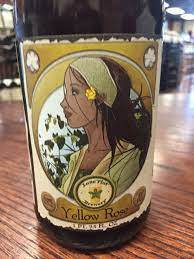
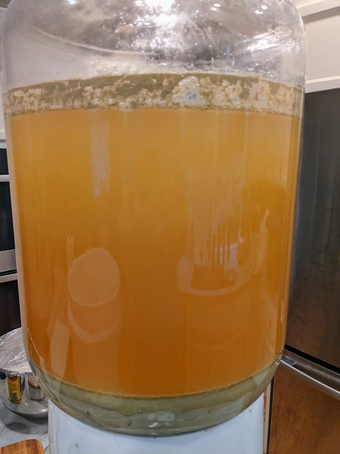
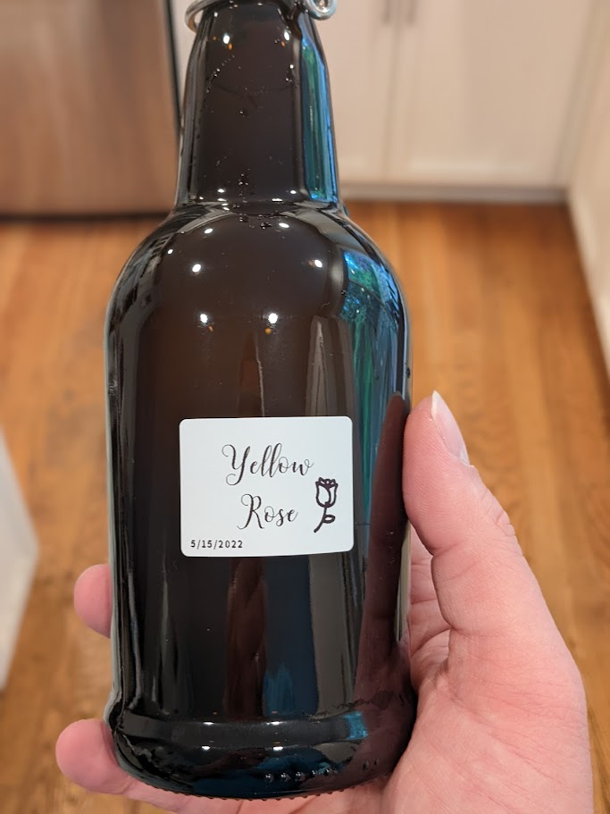

Yellow Rose IPA (Clone)
===================

I really liked this grapefruity IPA called [Yellow Rose](https://www.lonepint.com/the-core-brews) back in TX.  (I can't get it up here in WA.)

Discussion [here](https://www.homebrewtalk.com/threads/mosaic-s-m-a-s-h-yellow-rose-clone.494127/),
another recipe [here](https://www.homebrewersassociation.org/homebrew-recipe/yellow-rose-smash/).

My Recipe:
- 6 gallons water @ 152°F
- 13.5 lbs pilsner malt grain, mashed for 60m
- "Boil" for 30m (it took about 30m for my Digiboil to go from 152 to 200+°F)
- 0.5 oz Mosaic, wait 15m
- 0.5 oz Mosaic, wait 15m
- Chill to 170°F
- 2 oz Mosaic (whirlpooled), wait 15m
- Chill to 70°F
- [Imperial Flagship A07](https://www.imperialyeast.com/organic-yeast-strains/yeast-types/ale/flagship/)
  (was told similar to [White Labs California Ale WLP001](https://www.whitelabs.com/yeast-single?id=101&type=YEAST&style_type=0))
- 3 oz Mosaic dry hop for 3 days

Log
---

### 4/2/2022
- OG: 1.064
- Yield: 5 gallons
- Pitched at 90°F (time constrained)
- BIAG left a lot of [sediment](https://photos.app.goo.gl/tbKWbANu6yQa7uBR6).
- Dry hopped (3oz): 4/12/2022

5/15/2022:

- FG: 1.008
- Bottled w/ 5oz dextrose

My planned 3 day dry hop turned into a month.

 

Future Ideas
------------
From [here](https://beersmith.com/blog/2019/12/18/hop-utilization-in-the-whirlpool-for-beer-brewing/)  there's a bitterness table:

| Temp         |Utilization|
|--------------|-----------|
|100 C (212 F) |      100% |
| 90 C (194 F) |       49% |
| 80 C (176 F) |       23% |
| 70 C (158 F) |       10% |
| 60 C (140 F) |      4.3% |
| 50 C (122 F) |     1.75% |

Formula: Utilization = 2.39 * 10^11 * e^(-9773/T) where T is in Kelvin

Can prob. simplify hops schedule / lower the "whirlpooling" temp to maintain correct bitterness and maximize flavors from the Mosaic.
